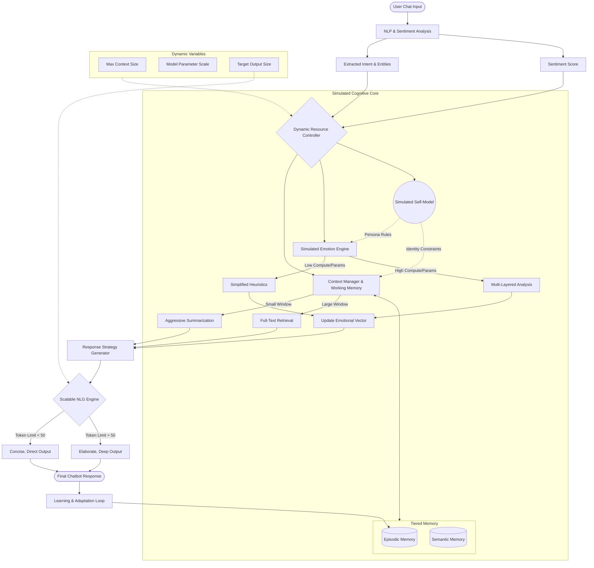

```mermaid
flowchart TD
    %% User Input
    User([User Chat Input]) --> NLP[NLP & Sentiment Analysis]
    NLP --> Intent[Extracted Intent & Entities]
    NLP --> Sentiment[Sentiment Score]

    %% Dynamic Parameters
    subgraph DynamicVars [Dynamic Variables]
        Context[Max Context Size]
        Params[Model Parameter Scale]
        OutputLimit[Target Output Size]
    end

    %% Routing
    Intent & Sentiment --> Controller{Dynamic Resource Controller}
    DynamicVars -.-> Controller

    %% Simulated Cognitive Core
    subgraph SimCore [Simulated Cognitive Core]
        
        %% Context Management
        Controller --> CM[Context Manager & Working Memory]
        CM -->|Small Window| Summarize[Aggressive Summarization]
        CM -->|Large Window| FullText[Full-Text Retrieval]
        
        %% Emotion Engine
        Controller --> SEE[Simulated Emotion Engine]
        SEE -->|Low Compute/Params| SimpleEmo[Simplified Heuristics]
        SEE -->|High Compute/Params| DeepEmo[Multi-Layered Analysis]
        SimpleEmo & DeepEmo --> EState[Update Emotional Vector]
        
        %% Self-Model
        Controller --> SSM((Simulated Self-Model))
        SSM -.->|Persona Rules| SEE
        SSM -.->|Identity Constraints| CM

        %% Memory
        subgraph TieredMem [Tiered Memory]
            Episodic[(Episodic Memory)]
            Semantic[(Semantic Memory)]
        end
        CM <--> TieredMem
    end

    %% Response Generation
    Summarize & FullText --> RSG[Response Strategy Generator]
    EState --> RSG
    
    RSG --> NLG{Scalable NLG Engine}
    OutputLimit -.-> NLG

    NLG -->|Token Limit < 50| Concise[Concise, Direct Output]
    NLG -->|Token Limit > 50| Elaborate[Elaborate, Deep Output]

    Concise & Elaborate --> Final([Final Chatbot Response])

    %% Adaptation Loop
    Final --> Loop[Learning & Adaptation Loop]
    Loop --> Episodic
```
